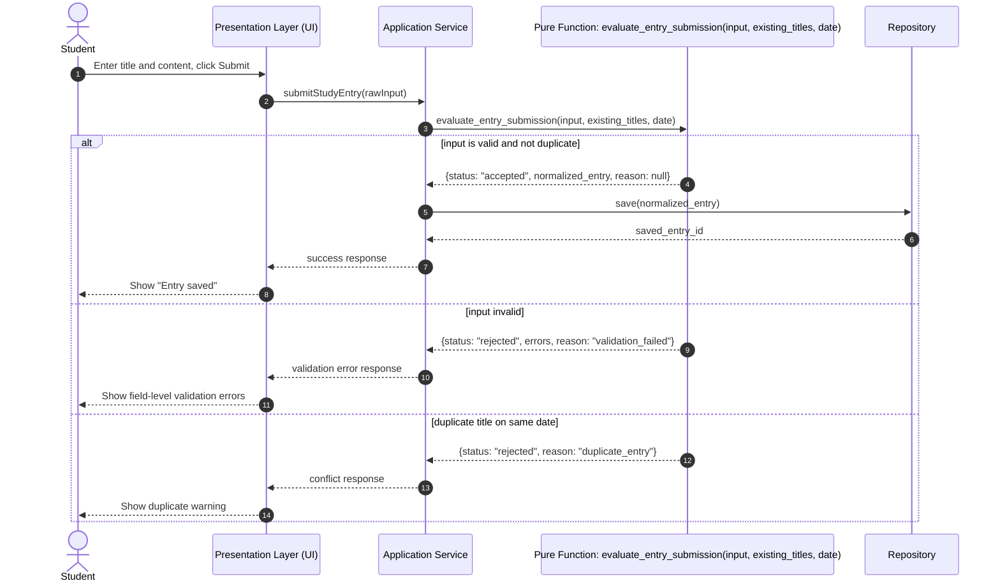

# Flow: Study Entry Submission

```mermaid
sequenceDiagram
    autonumber
    actor Student
    participant UI as Presentation Layer (UI)
    participant App as Application Service
    participant PF as Pure Function: evaluate_entry_submission(input, existing_titles, date)
    participant Repo as Repository

    Student->>UI: Enter title and content, click Submit
    UI->>App: submitStudyEntry(rawInput)
    App->>PF: evaluate_entry_submission(input, existing_titles, date)

    alt input is valid and not duplicate
        PF-->>App: {status: "accepted", normalized_entry, reason: null}
        App->>Repo: save(normalized_entry)
        Repo-->>App: saved_entry_id
        App-->>UI: success response
        UI-->>Student: Show "Entry saved"
    else input invalid
        PF-->>App: {status: "rejected", errors, reason: "validation_failed"}
        App-->>UI: validation error response
        UI-->>Student: Show field-level validation errors
    else duplicate title on same date
        PF-->>App: {status: "rejected", reason: "duplicate_entry"}
        App-->>UI: conflict response
        UI-->>Student: Show duplicate warning
    end
```
