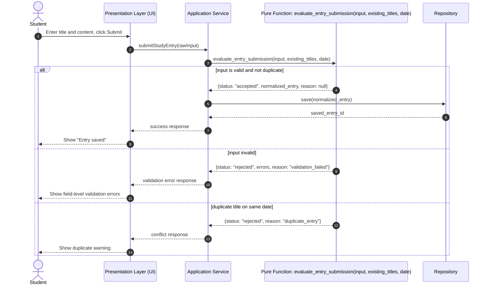

# EXP-2026-05-16 Pure Function Experiment

## Feature
Study Entry Submission

## Prompt Provided To AI
Using the following BDD requirements and Mermaid sequence diagram, write the logic for this feature as a pure function. It must have no side effects (stateless) and must return a predictable output.

### BDD Requirements
- As a student, I want to submit a study entry, so that my progress is saved and available for later review.
- Given a student provides a non-empty title and non-empty content
  When the student submits a new study entry
  Then the system returns a successful result with status "accepted" and a normalized entry payload
- Given a student provides an empty title or empty content
  When the student submits a new study entry
  Then the system returns a validation error with status "rejected" and a clear reason for each invalid field
- Given a student already has a submitted entry with the same normalized title on the same date
  When the student submits another entry with that title on that date
  Then the system returns a conflict error with status "rejected" and reason "duplicate_entry"

### Mermaid Diagram

## Experiment Result
The AI produced correct validation structure on the first try, but initially included persistence logic (repository save) inside the function.

## Did AI Succeed On First Try?
Partially. Logic was close, but not fully pure because side effects were mixed into the function.

## Did I Need To Adjust BDD Or Diagram?
Yes. I clarified the constraint that the function must only compute and return a decision object, with no database, API, file, or UI calls.

## Final Conclusion
With explicit pure-function constraints and clear BDD + Mermaid context, the AI generated a deterministic stateless solution.
